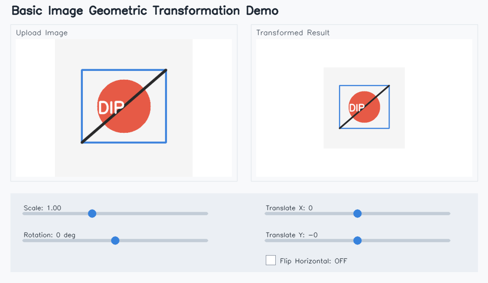
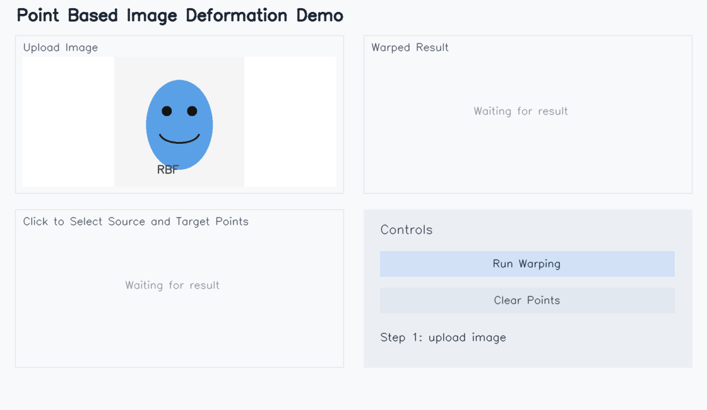

# Assignment 01 - Image Warping

本作业实现了图像全局几何变换和点引导图像变形。代码分为两个独立脚本，分别对应 Basic Image Geometric Transformation 和 Point Based Image Deformation。

## Requirements

```bash
python -m pip install -r requirements.txt
```

主要依赖为 `opencv-python`、`numpy` 和 `gradio`。

## Running

运行全局几何变换交互界面：

```bash
python run_global_transform.py
```

运行点引导变形交互界面：

```bash
python run_point_transform.py
```

无输入快速生成提交用示例结果：

```bash
python run_global_transform.py --demo
python run_point_transform.py --demo
```

## Evaluation

运行两个 `--demo` 命令后，检查 `pics/` 中生成的动态演示：

- `pics/global_demo.gif`
- `pics/point_demo.gif`

全局变换 demo 展示缩放、旋转、平移和翻转参数变化后的输出；点引导变形 demo 展示交替选择 source / target 控制点并运行 warping 后的结果，图像没有明显前向映射空洞。

## Results

| Task | Method | Output |
| --- | --- | --- |
| Basic transformation | 3x3 homogeneous affine matrix + `cv2.warpAffine` | `pics/global_demo.gif` |
| Point guided deformation | RBF/TPS displacement field + inverse sampling | `pics/point_demo.gif` |

### Basic Image Geometric Transformation



### Point Based Image Deformation



## Implementation Notes

全局变换将缩放、旋转、平移和水平翻转都写成齐次矩阵，并在图像中心附近组合：

```text
M = T_move @ T_center @ R @ S @ F @ T_uncenter
```

点引导变形采用 RBF/薄板样条位移插值。用户交替点击源点和目标点，程序求解从目标平面回到源平面的位移场，再使用 `cv2.remap` 做反向采样：

```text
source_i = target_i + d(target_i)
```

## Files

- `run_global_transform.py`: 全局仿射变换和 Gradio 界面。
- `run_point_transform.py`: RBF 点引导变形和 Gradio 界面。
- `requirements.txt`: 运行依赖。
