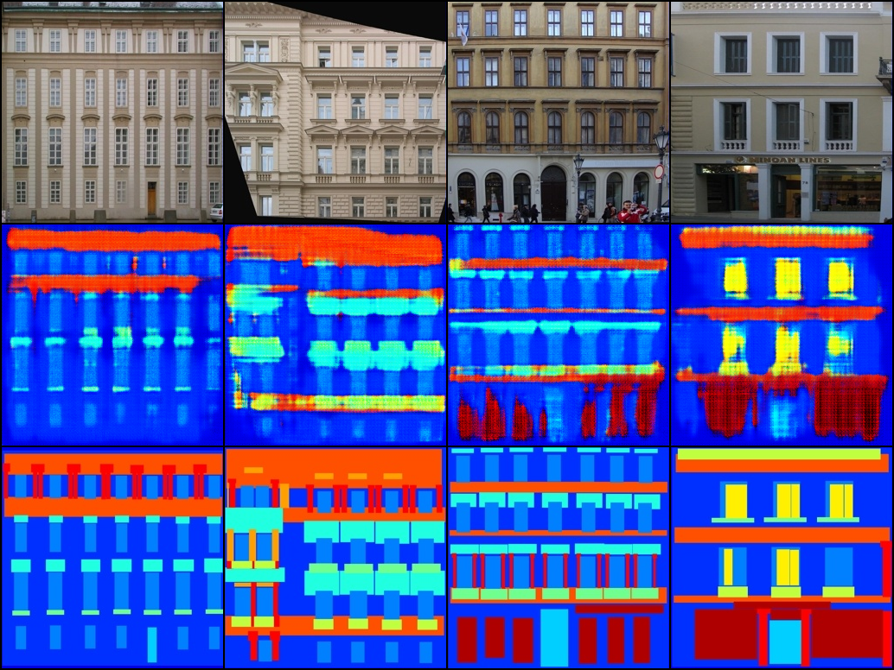

# Assignment 02 - DIP with PyTorch

本作业包含两部分：传统的 Poisson Image Editing，以及基于 PyTorch 的 Pix2Pix 条件图像翻译训练代码。

## Requirements

```bash
python -m pip install -r requirements.txt
```

主要依赖为 `torch`、`torchvision`、`opencv-python`、`gradio` 和 `Pillow`。

## Training and Running

### Task 1: Poisson Image Editing

运行交互界面：

```bash
python run_blending_gradio.py
```

无界面快速生成示例：

```bash
python run_blending_gradio.py --demo
```

如果 CPU 运行较慢，可以降低迭代次数：

```bash
python run_blending_gradio.py --steps 800
```

### Task 2: Pix2Pix

`Pix2Pix` 子目录实现了 U-Net 风格生成器、PatchGAN 判别器、facades 拼接图像读取和 adversarial loss + L1 loss 训练流程。

训练命令示例：

```bash
cd Pix2Pix
python train.py --data_root ../../facades --output_dir runs/facades_full --epochs 20 --batch_size 4 --image_size 256 --preview_every 5 --save_every 10 --device cuda
```

数据集目录需要满足：

```text
C:/Users/14586/Desktop/数字图像处理/facades/
  train/*.jpg
  val/*.jpg
  test/*.jpg
```

本机已下载 facades 数据集，并完成 20 epoch 训练。训练 preview 输出在 `Pix2Pix/runs/facades_full/previews/`，checkpoint 输出在 `Pix2Pix/runs/facades_full/checkpoints/`。由于 checkpoint 单个约 384 MB，提交时建议只保留结果图，模型可按上述命令复现。

## Evaluation

Poisson 部分运行 `--demo` 后检查：

- `pics/poisson_demo.png`

Pix2Pix 部分可通过训练时生成的 preview 图进行定性评估，并对比 source、generated 和 target 三列的结构一致性。训练脚本中的 `--lambda_l1` 默认取 100，与 Pix2Pix 论文常用设置一致。

preview 图排列方式为：第一行 source，第二行 generated，第三行 target。

## Results

| Task | Status | Result |
| --- | --- | --- |
| Poisson Image Editing | 已实跑 | `pics/poisson_demo.png` |
| Pix2Pix | facades 20 epoch 已实跑 | `pics/pix2pix_facades_epoch_0020.png` |

### Poisson Image Editing


### Pix2Pix

本机 Pix2Pix 训练配置：

| Item | Value |
| --- | ---: |
| Dataset | facades |
| Train images | 400 |
| Val images | 100 |
| Test images | 106 |
| Epochs | 20 |
| Batch size | 4 |
| Image size | 256 x 256 |
| Device | CUDA |



已完成的代码包括：

- `Pix2Pix/FCN_network.py`: U-Net 风格生成器和 PatchGAN 判别器。
- `Pix2Pix/facades_dataset.py`: 读取 facades 左右拼接图，并拆分为 source/target。
- `Pix2Pix/train.py`: 判别器损失、生成器 adversarial loss、L1 loss、preview 和 checkpoint 保存。

## Pre-trained Models

当前没有外部预训练模型。本机 20 epoch 训练生成了 checkpoint：

```text
Pix2Pix/runs/facades_full/checkpoints/pix2pix_0010.pt
Pix2Pix/runs/facades_full/checkpoints/pix2pix_0020.pt
```

checkpoint 体积较大，提交时可不上传，按 Training 命令可复现。

## Files

- `run_blending_gradio.py`: Poisson 融合、mask 构造和 Gradio 界面。
- `Pix2Pix/FCN_network.py`: 生成器和判别器。
- `Pix2Pix/facades_dataset.py`: facades 数据读取。
- `Pix2Pix/train.py`: Pix2Pix 训练脚本。
- `requirements.txt`: 运行依赖。
