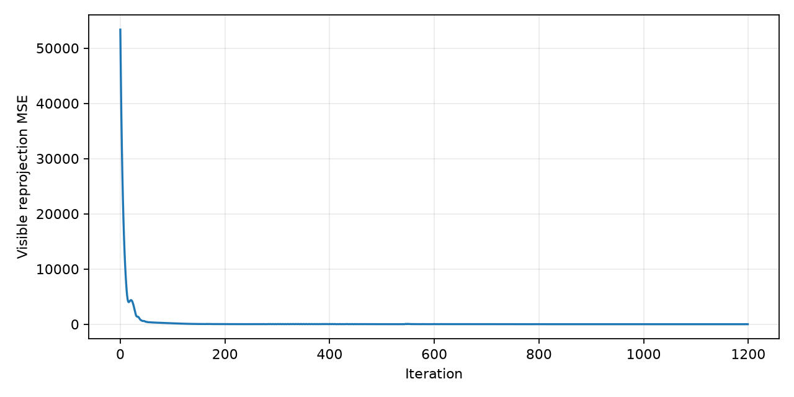
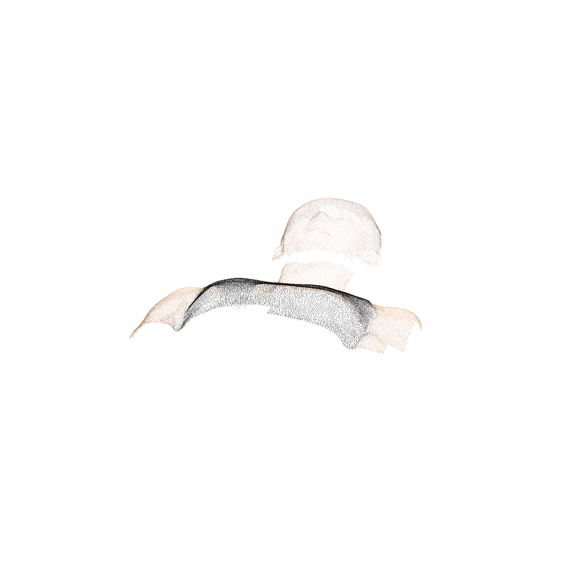
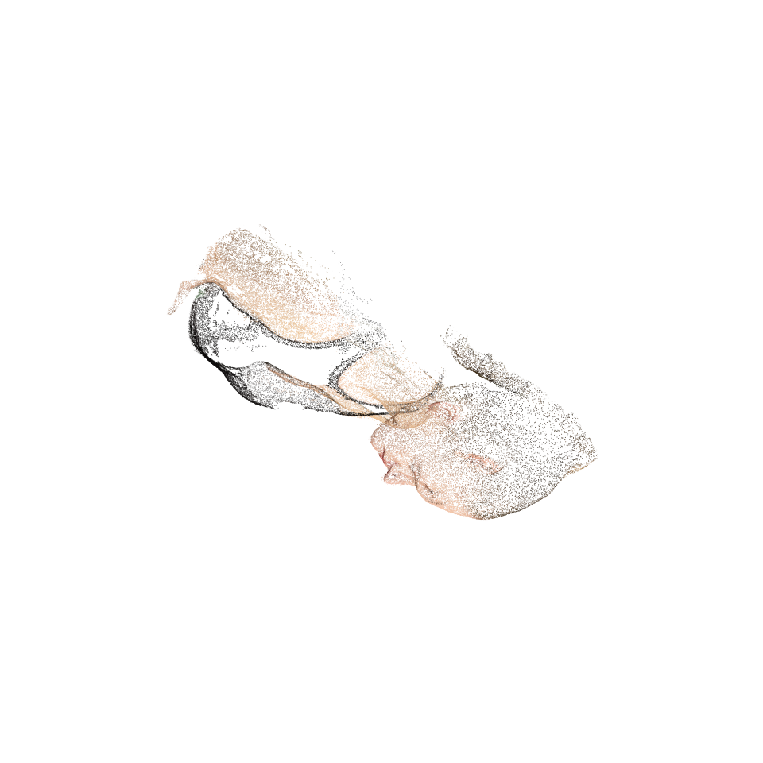

# Assignment 03 - Bundle Adjustment

本作业包含两部分：使用 PyTorch 从 2D 观测优化 Bundle Adjustment，以及使用 COLMAP/pycolmap 从多视角图像恢复稀疏与稠密三维结构。

## Requirements

```bash
python -m pip install -r requirements.txt
```

本机验证环境：

- GPU: NVIDIA GeForce RTX 5060
- PyTorch: 2.11.0+cu128
- CUDA available: True
- pycolmap: 4.0.4
- COLMAP: 4.1.0.dev0 with CUDA

## Data

实验数据已放在本作业目录下：

```text
Assignment_03/
  data/
    images/
    points2d.npz
    points3d_colors.npy
```

## Training

### Task 1: Bundle Adjustment with PyTorch

本实现从 2D 观测中同时优化：

- 共享焦距 `f`
- 每个视角的 Euler 角旋转和平移
- 所有 3D 点坐标

投影模型：

```text
Pc = R @ Pw + T
u = -f * Xc / Zc + cx
v =  f * Yc / Zc + cy
```

快速调试命令：

```bash
python bundle_adjustment.py --data_dir data --iterations 1200 --max_points 3000
```

本机完整 20000 点验证命令：

```bash
python bundle_adjustment.py --data_dir data --iterations 1200 --max_points 20000 --output_dir outputs_full --device cuda
```

### Task 2: 3D Reconstruction with COLMAP

本机已下载 COLMAP Windows CUDA 预编译包到 `../.tools/COLMAP.bat`。完整 sparse + dense reconstruction 命令：

```powershell
powershell -ExecutionPolicy Bypass -File scripts/run_colmap_windows.ps1 -DataDir data -Colmap "..\.tools\COLMAP.bat" -Dense -Force
```

Linux/macOS 可运行：

```bash
bash scripts/run_colmap.sh
```

脚本会运行 feature extraction、exhaustive matching、mapper、image undistortion、PatchMatch Stereo 和 stereo fusion。新版 COLMAP 参数已在脚本中适配为 `FeatureExtraction.use_gpu` 和 `FeatureMatching.use_gpu`。

另外也保留了 pycolmap sparse fallback：

```bash
python scripts/run_colmap_py.py --data_dir data --force
```

## Evaluation

Bundle Adjustment 以可见点重投影误差作为指标，输出 loss 曲线、带颜色 OBJ 点云和相机参数：

- `outputs_full/loss_curve.png`
- `outputs_full/reconstruction.obj`
- `outputs_full/reconstruction_preview.png`
- `outputs_full/camera_params.npz`

COLMAP sparse/dense 部分检查以下文件：

- `data/colmap/sparse/0/cameras.bin`
- `data/colmap/sparse/0/images.bin`
- `data/colmap/sparse/0/points3D.bin`
- `data/colmap/dense/fused.ply`
- `outputs_full/dense_fused_preview.png`

mapper 可能生成多个 sparse model。本次 dense 使用注册图像最多的 `data/colmap/sparse/0`，其中包含 50 张注册图像。

## Results

### PyTorch Bundle Adjustment

| Item | Value |
| --- | ---: |
| Iterations | 1200 |
| Points | 20000 |
| Final visible reprojection MSE | 0.0411 |
| Best visible reprojection RMSE | 0.2028 px |
| Optimized focal length | 863.32 px |

Loss curve:



Reconstructed point cloud preview:



### COLMAP Sparse and Dense Reconstruction

| Item | Value |
| --- | ---: |
| Input images | 50 |
| COLMAP sparse model | `data/colmap/sparse/0` |
| Registered images | 50 |
| Sparse points | 1693 |
| Mean reprojection error | 0.6520 px |
| Dense output | `data/colmap/dense/fused.ply` |
| Dense fused points | 145589 |

Dense fused point cloud preview:



### pycolmap Sparse Fallback

| Item | Value |
| --- | ---: |
| Input images | 50 |
| Sparse model | `data/colmap_py/sparse/0` |
| Output files | `cameras.bin`, `images.bin`, `points3D.bin`, `rigs.bin`, `frames.bin` |

## Pre-trained Models

本作业不包含神经网络预训练模型。优化结果保存在：

```text
outputs_full/camera_params.npz
outputs_full/reconstruction.obj
```

## Files

- `bundle_adjustment.py`: PyTorch Bundle Adjustment 优化。
- `visualize_observations.py`: 2D 观测可视化。
- `scripts/run_colmap_py.py`: pycolmap sparse reconstruction fallback。
- `scripts/run_colmap_windows.ps1`: Windows COLMAP CLI 流程。
- `scripts/run_colmap.sh`: Linux/macOS COLMAP CLI 流程。
- `requirements.txt`: 运行依赖。
