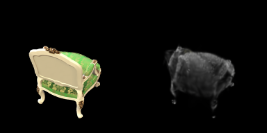

# Assignment 04 - Simplified 3D Gaussian Splatting

本作业实现了一个纯 PyTorch 的简化 3D Gaussian Splatting pipeline：先用 COLMAP/pycolmap 从多视角图像恢复相机和 sparse points，再将 sparse points 初始化为 3D Gaussians，并通过可微渲染优化颜色、位置、尺度、旋转和不透明度。

## Requirements

```bash
python -m pip install -r requirements.txt
```

本机验证环境：

- GPU: NVIDIA GeForce RTX 5060
- PyTorch: 2.11.0+cu128
- CUDA available: True
- pycolmap: 4.0.4

## Data

本次 full run 使用 `chair` 场景：

```text
data/chair/
  images/
  sparse/0/
```

`lego` 图像也已保留在 `data/lego/images/`，可以用相同脚本重新运行。

## Training and Running

### Task 1: COLMAP Initialization

如果本机安装了独立 `colmap.exe`，可直接运行：

```bash
python mvs_with_colmap.py --data_dir data/chair
python debug_mvs_by_projecting_pts.py --data_dir data/chair
```

本机未安装独立 `colmap.exe`，因此使用 `pycolmap` fallback 完成 sparse reconstruction：

```bash
python mvs_with_colmap.py --data_dir data/chair --pycolmap --force
python debug_mvs_by_projecting_pts.py --data_dir data/chair --max_views 3 --resize 256
```

### Task 2: Simplified 3DGS

本实现把 COLMAP sparse points 初始化为 3D Gaussians，并优化：

- position
- quaternion rotation
- anisotropic scale
- RGB color
- opacity

渲染流程：

1. 由四元数和 scale 计算 3D covariance。
2. 使用透视投影 Jacobian 得到 2D covariance。
3. 逐像素计算 2D Gaussian 响应。
4. 按深度排序做 alpha blending。

本机 CUDA full run 命令：

```bash
python train.py --colmap_dir data/chair --checkpoint_dir data/chair/checkpoints_full --num_epochs 10 --resize 192 --max_points 1500 --debug_every 1 --save_every 2 --device cuda
```

快速 smoke test：

```bash
python train.py --colmap_dir data/chair --checkpoint_dir data/chair/checkpoints_verify --num_epochs 2 --resize 128 --max_points 800 --device cuda
```

## Evaluation

COLMAP 初始化检查：

- sparse model: `data/chair/sparse/0`
- projection debug images: `data/chair/projection_debug/`

3DGS 训练检查：

- checkpoint: `data/chair/checkpoints_full/checkpoint_000010.pt`
- debug image: `data/chair/checkpoints_full/debug/epoch_0010.png`
- multi-view video: `data/chair/checkpoints_full/render_full.mp4`

Full run 多视角视频命令：

```bash
python render_3dgs_mv.py --colmap_dir data/chair --checkpoint data/chair/checkpoints_full/checkpoint_000010.pt --output data/chair/checkpoints_full/render_full.mp4 --num_frames 60 --fps 15 --resize 192 --max_points 1500 --device cuda
```

## Results

### COLMAP / pycolmap Initialization

| Item | Value |
| --- | ---: |
| Scene | chair |
| Input images | 100 |
| Registered images | 100 |
| Sparse model | `data/chair/sparse/0` |
| Projection debug images | `data/chair/projection_debug/` |

### Simplified 3DGS Full Run

| Item | Value |
| --- | ---: |
| Training images | 100 |
| Registered images | 100 |
| Gaussian points | 1500 |
| Render size | 192 x 192 |
| Epochs | 10 |
| Final mean L1 | 0.09190 |

逐轮 mean L1：

| Epoch | Mean L1 |
| ---: | ---: |
| 1 | 0.10815 |
| 2 | 0.09836 |
| 3 | 0.09600 |
| 4 | 0.09452 |
| 5 | 0.09330 |
| 6 | 0.09277 |
| 7 | 0.09246 |
| 8 | 0.09226 |
| 9 | 0.09206 |
| 10 | 0.09190 |

Debug render at epoch 10:



输出文件：

- `data/chair/checkpoints_full/checkpoint_000002.pt`
- `data/chair/checkpoints_full/checkpoint_000004.pt`
- `data/chair/checkpoints_full/checkpoint_000006.pt`
- `data/chair/checkpoints_full/checkpoint_000008.pt`
- `data/chair/checkpoints_full/checkpoint_000010.pt`
- `data/chair/checkpoints_full/debug/epoch_0010.png`
- `data/chair/checkpoints_full/render_full.mp4`

## Comparison with Official 3DGS

本作业实现的是教学版纯 PyTorch renderer，未包含官方 3DGS 的 CUDA tile rasterizer、adaptive densification 和 pruning。本机没有额外编译官方 3DGS，因此官方列为基于实现机制的定性对比；实际提交中不把该表伪装为官方实测 benchmark。

| Aspect | This implementation | Official 3DGS |
| --- | --- | --- |
| Renderer | Pure PyTorch, full-image Gaussian evaluation | CUDA tile rasterizer |
| Initialization | pycolmap sparse points | COLMAP sparse points |
| Densification / pruning | Not implemented | Implemented |
| Local run result | 10 epochs, 1500 points, final mean L1 0.09190 | Not run locally |
| Training speed | Slower because each Gaussian is evaluated over the image grid | Much faster due to CUDA kernels and tiling |
| Memory usage | Higher for the same image size and point count | More efficient |
| Rendering quality | Coarse but verifies the whole pipeline | Expected to be sharper and denser |

## Pre-trained Models

本作业没有外部预训练模型。当前 full run 的本地 checkpoint 可作为复现实验的中间结果：

```text
data/chair/checkpoints_full/checkpoint_000010.pt
```

## Files

- `mvs_with_colmap.py`: COLMAP/pycolmap 初始化。
- `debug_mvs_by_projecting_pts.py`: sparse points 重投影检查。
- `gaussian_model.py`: Gaussian 参数和 covariance。
- `gaussian_renderer.py`: 投影、2D Gaussian、alpha blending。
- `data_utils.py`: COLMAP 文本/二进制模型读取和 Dataset。
- `train.py`: 训练、debug 图和 checkpoint 保存。
- `render_3dgs_mv.py`: 多视角视频渲染。
- `requirements.txt`: 运行依赖。
